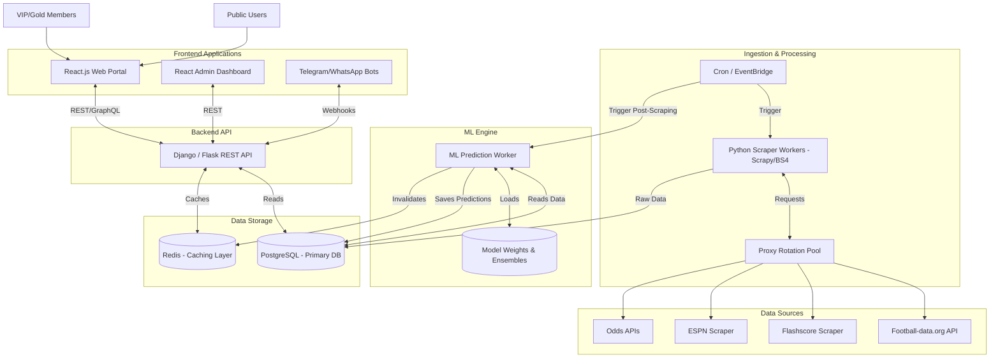

# System Architecture: Automated Football Prediction Portal

The system is designed for high availability, scalable data ingestion, and rapid prediction delivery.

## Component Details
1. **Data Sources**: Web scrapers and APIs to fetch team form, historical data, odds, injuries, and weather.
2. **Ingestion & Processing**: Python scrapers operating with proxy rotation to avoid rate limits, orchestrated by a cron or message queue (Celery).
3. **Data Storage**: PostgreSQL handles complex queries for historical data and predictions. Redis provides sub-millisecond response times for frontend leaderboards and daily tips.
4. **ML Engine**: A separate worker process that loads pre-trained SciKit-Learn/XGBoost/LSTM models, ingests newly scraped data, runs inferences, filters high-confidence predictions (>70%), and computes Kelly Criterion stake sizing.
5. **Backend API**: Python (Django or Flask) backend serving RESTful endpoints for the UI, including authentication, payment webhooks, and prediction delivery.
6. **Frontend**: React application styled with Tailwind CSS containing both the public marketing pages, VIP dashboard, and Admin portal.
